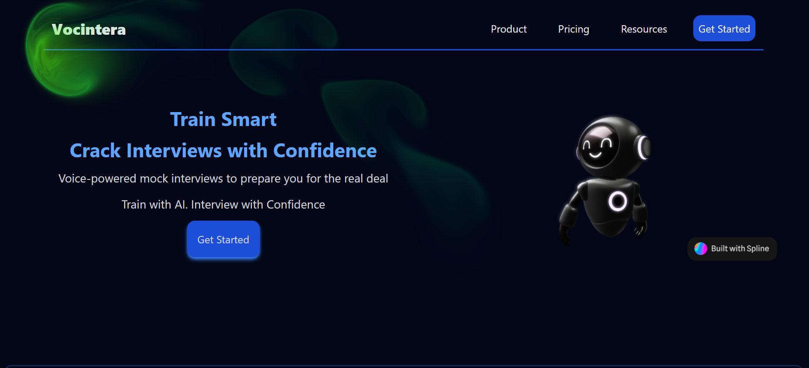
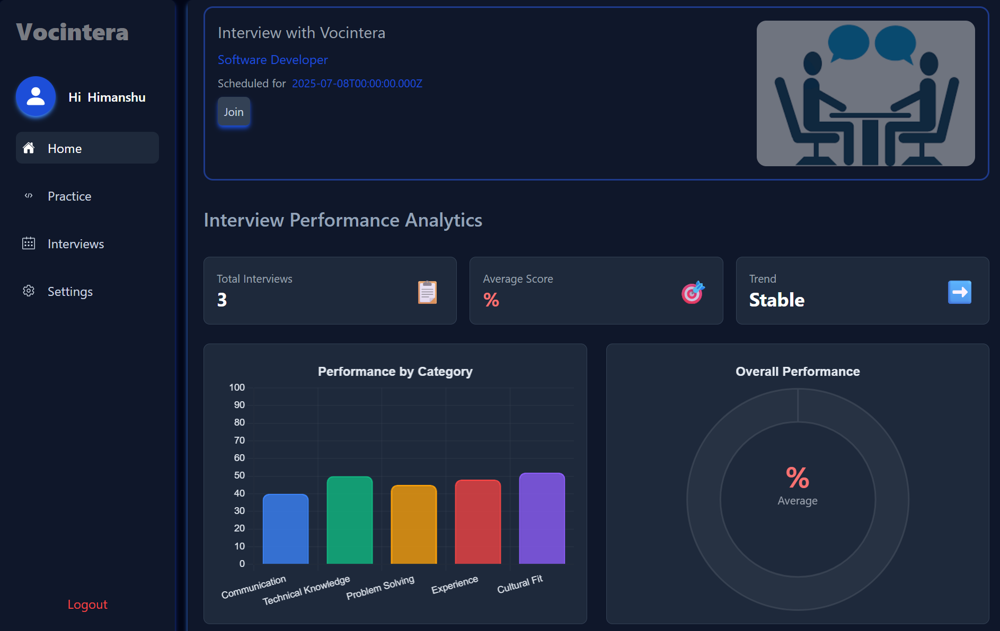
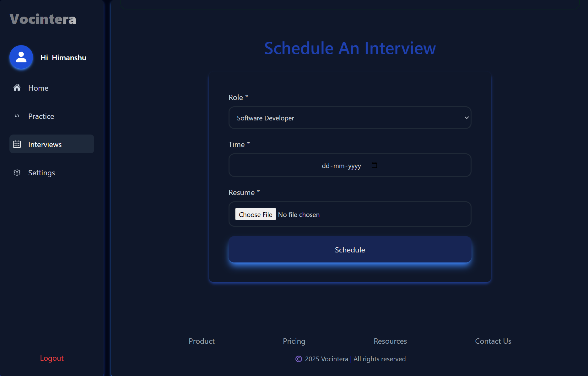
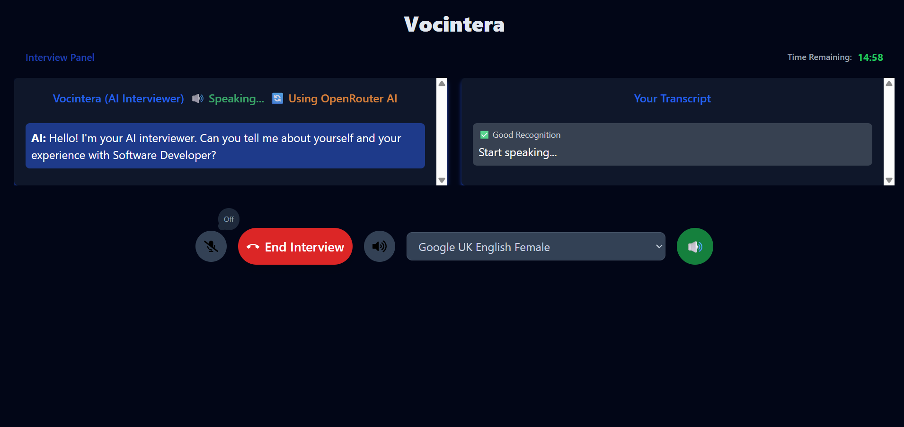
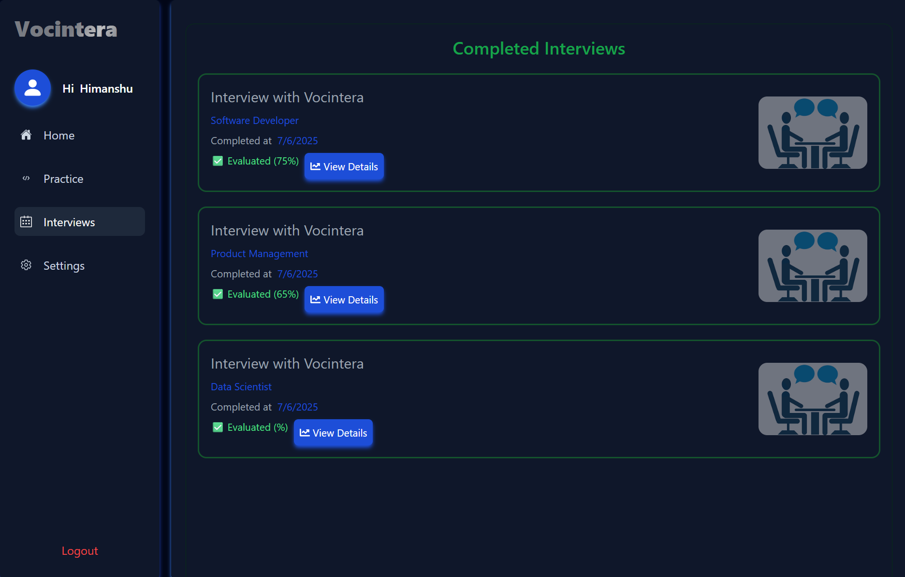
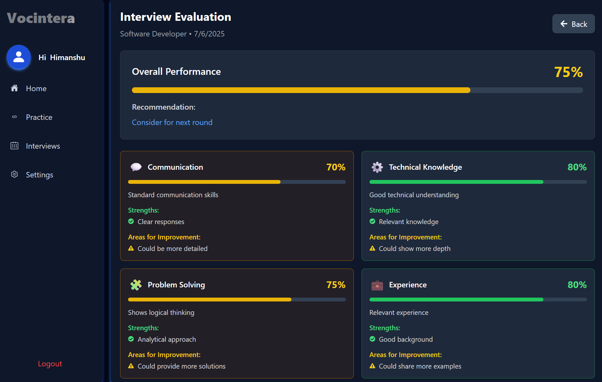

# VocIntera

[Live Demo](https://vocintera.onrender.com)

---

## Overview
VocIntera is an AI-powered interview platform that leverages Google Gemini AI to conduct interactive interviews. It provides a seamless experience for candidates to engage in AI-driven interviews and for interviewers to manage interview sessions.

## Features
- AI-driven interview question generation and response evaluation
- Real-time speech recognition and transcription
- Interview history tracking
- User authentication and interview scheduling

## Tech Stack

### Backend
- Node.js with Express.js for REST API
- MongoDB with Mongoose for database
- Google Gemini AI SDK (`@google/genai`) for AI interactions

### Frontend
- React.js for UI
- Tailwind CSS for styling
- Web Speech API for speech recognition

## Project Structure

```
backend/
  ├── src/
  │   ├── controllers/       # API route handlers
  │   ├── models/            # Mongoose schemas
  │   ├── services/          # Business logic and external API integrations
  │   ├── middleware/        # Express middleware
  │   ├── app.js             # Express app setup
  │   └── index.js           # Server entry point
frontend/
  ├── src/
  │   ├── Components/        # Reusable React components
  │   ├── Pages/             # React pages
  │   ├── App.js             # Main React component
  │   └── index.js           # React entry point

```

## UI Screenshots













## Getting Started

### Prerequisites
- Node.js v20+
- MongoDB instance
- Google Gemini AI API key

### Installation

1. Clone the repository
2. Install backend dependencies: `npm install` in `backend/`
3. Install frontend dependencies: `npm install` in `frontend/`
4. Set environment variables in `.env` files for backend and frontend
5. Run backend server: `npm start` in `backend/`
6. Run frontend app: `npm start` in `frontend/`

## Usage
- Register and login
- Schedule or join interviews
- Interact with AI interviewer

## License
MIT License

---

For more details, please refer to the source code and documentation within the repository.
